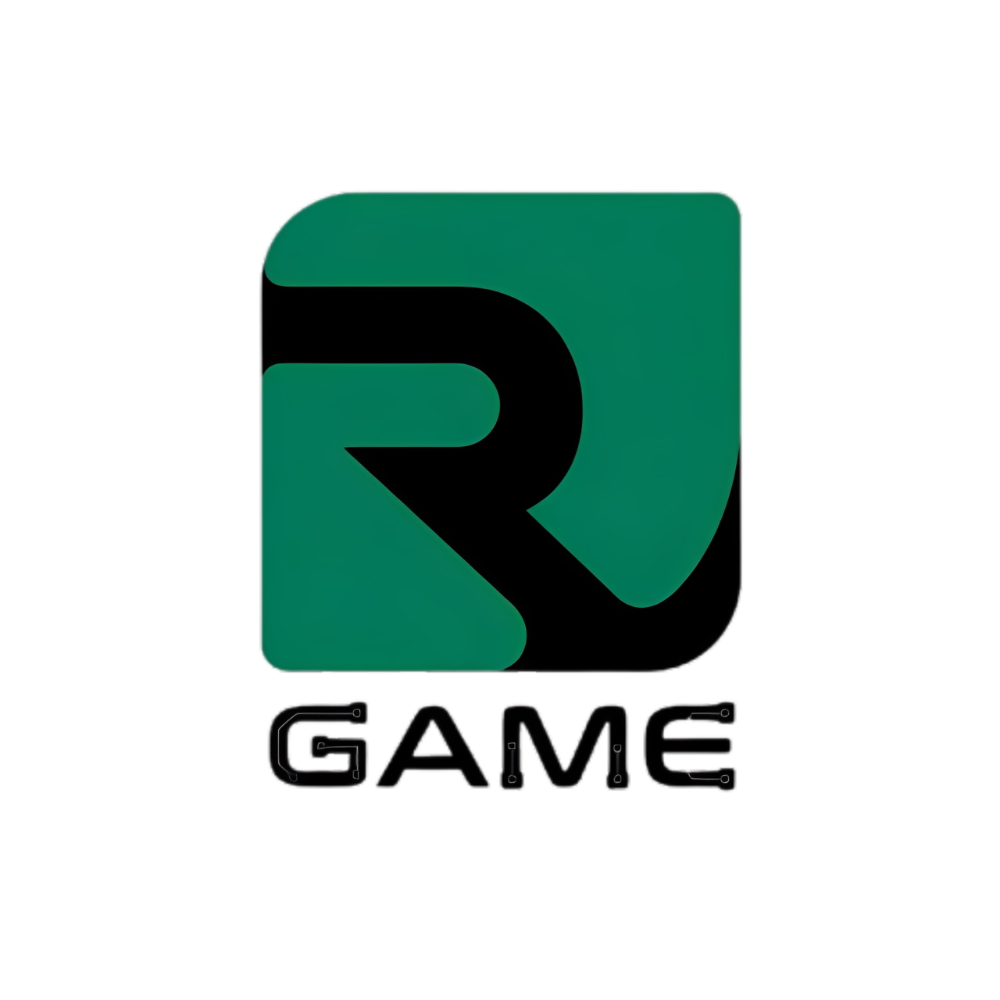

<p align="center">
  
</p>

<h1 align="center">Rush Protocol</h1>

<p align="center">
  <strong>On-chain prediction market with AI-verified outcomes on Base</strong>
</p>

<p align="center">
  <a href="https://rushgame.vip">Live App</a> &middot;
  <a href="https://basescan.org/address/0xf3edae04f632bc4cfde9a08e06f36a17bfaee83f#code">BurnMarketFactory</a> &middot;
  <a href="https://basescan.org/address/0x5b7b2a6AC4f3A017fb943C9F550d609174532fFF#code">RushTiles V2</a> &middot;
  <a href="https://basescan.org/address/0xB36A127dBa73F3aA7C70B4e00B7395B86A60e73b">$RUSH</a> &middot;
  <a href="https://x.com/rushgamebase">Twitter</a>
</p>

<p align="center">
  
  
  
</p>

---

## What is Rush?

Rush is a **fully on-chain prediction market** where users bet on real-world outcomes verified by computer vision. Winners split the entire pool with **zero house edge** -- odds are purely pari-mutuel.

The protocol runs two parallel economies:

- **$RUSH markets** (BurnMarket) -- 70% to winners, 30% burned forever. Pure deflation, zero fees.
- **ETH markets** (PredictionMarket) -- 5% fee flows to RushTiles holders, making every tile holder a protocol partner.

Revenue and burn mechanics are enforced on-chain and **cannot be changed by anyone**.

### How It Works

1. **Watch** -- Live traffic cameras stream 24/7 from real locations (currently Konya, Turkey)
2. **Predict** -- Guess if the vehicle count goes OVER or UNDER the threshold in 5 minutes
3. **Win** -- Correct predictions split the pool, all verified on-chain
4. **Earn** -- Hold a RushTile to receive a share of every ETH market's fees, or bet $RUSH to burn supply

---

## Architecture

```
+-------------------------------------------------------------+
|  Frontend (Next.js 14, wagmi v2, Ably real-time)            |
|  rushgame.vip (Vercel)                                       |
+-------------------------------------------------------------+
         |                    |                    |
         v                    v                    v
+------------------+  +------------------+  +------------------+
| BurnMarketFactory|  | MarketFactory    |  | RushTiles V1/V2  |
| + BurnMarket     |  | + PredictionMkt  |  | 100 quotas each  |
| $RUSH markets    |  | ETH markets      |  | Harberger tax    |
| 70/30 win/burn   |  | 5% fee           |  | Revenue sharing  |
+------------------+  +------------------+  +------------------+
         \                    |                    /
          \                   |                   /
           v                  v                  v
+-------------------------------------------------------------+
|  Base Mainnet (EVM, 2s blocks, Chainstack RPC)              |
+-------------------------------------------------------------+
                              ^
                              |
+-------------------------------------------------------------+
|  Oracle Engine (Python, YOLOv8x, BoT-SORT)                  |
|  Line-crossing detection, evidence frames, SHA-256 hashes   |
|  WebSocket broadcast, Cloudflare tunnel                      |
+-------------------------------------------------------------+
                              ^
                              |
+-------------------------------------------------------------+
|  Live Camera Feed (YouTube Live, HLS, MJPEG)                |
|  Currently: Konya, Turkey (7 cameras configured)            |
+-------------------------------------------------------------+
```

---

## Smart Contracts

All contracts are **open source** and **verified on Basescan**.

### Deployed Addresses (Base Mainnet)

| Contract | Address | Status |
|----------|---------|--------|
| **BurnMarketFactory** | [`0xf3edae04f632bc4cfde9a08e06f36a17bfaee83f`](https://basescan.org/address/0xf3edae04f632bc4cfde9a08e06f36a17bfaee83f#code) | Production |
| **RushTiles V2** (Series 2) | [`0x5b7b2a6AC4f3A017fb943C9F550d609174532fFF`](https://basescan.org/address/0x5b7b2a6AC4f3A017fb943C9F550d609174532fFF#code) | Production |
| **RushTiles V1** (Series 1) | [`0x6cE3873e31Ab5440fA6AF1860F8E36110504c9C4`](https://basescan.org/address/0x6cE3873e31Ab5440fA6AF1860F8E36110504c9C4#code) | Production |
| **$RUSH Token** | [`0xB36A127dBa73F3aA7C70B4e00B7395B86A60e73b`](https://basescan.org/address/0xB36A127dBa73F3aA7C70B4e00B7395B86A60e73b) | Production |
| MarketFactory (ETH) | [`0x5b04F3DFaE780A7e109066E754d27f491Af55Af9`](https://basescan.org/address/0x5b04F3DFaE780A7e109066E754d27f491Af55Af9#code) | Deprecated |

**Oracle/Admin:** `0x4c385830c2E241EfeEd070Eb92606B6AedeDA277`
**Fee Recipient:** `0xdd12D83786C2BAc7be3D59869834C23E91449A2D`

### Contract Overview

| Contract | Purpose |
|----------|---------|
| **BurnMarketFactory** | Deploys `BurnMarket` instances for $RUSH token rounds |
| **BurnMarket** | Holds $RUSH bets, resolves outcomes, 70% to winners / 30% burned to `0xdead` |
| **MarketFactory** | Deploys `PredictionMarket` instances for ETH rounds |
| **PredictionMarket** | Holds ETH bets, resolves outcomes, distributes winnings minus 5% fee |
| **RushTiles V1** | Series 1 -- 100 tiles, 1 share each, Harberger tax, revenue sharing |
| **RushTiles V2** | Series 2 -- 100 tiles, Founder (0.5 ETH, 5 shares) + Normal (0.1 ETH, 1 share) tiers |
| OracleRegistry | Dormant -- oracle staking/slashing framework ready for multi-oracle |
| DataAttestation | Dormant -- commit-reveal scheme for oracle honesty |
| ConsensusEngine | Dormant -- multi-oracle median consensus with tolerance |
| DisputeManager | Dormant -- post-resolution dispute handling |

### Market Lifecycle

```
OPEN ────> LOCKED ────> RESOLVED
  |                        |
  | (no bets)              | (auto-distribute to winners)
  v                        v
CANCELLED              distributeAll()
  |
  v
refundAll()
```

**Round timing:** 150s betting window + 150s counting = 5 min total round.

### Pari-Mutuel Odds

There is no house edge. Odds are determined purely by the pool distribution:

**$RUSH markets (BurnMarket):**
```
Burn Amount = Total Pool x 30% (sent to 0xdead)
Distributable Pool = Total Pool x 70%
Your Payout = (Your Bet / Winning Side Pool) x Distributable Pool
```

**ETH markets (PredictionMarket):**
```
Protocol Fee = Total Pool x 5% (to RushTiles holders)
Distributable Pool = Total Pool x 95%
Your Payout = (Your Bet / Winning Side Pool) x Distributable Pool
```

The fee rates are hardcoded in the contracts and **cannot be changed by anyone**.

---

## $RUSH Token

$RUSH is the native token of the Rush Protocol, launched on [Flaunch](https://flaunch.gg).

- **Contract:** [`0xB36A127dBa73F3aA7C70B4e00B7395B86A60e73b`](https://basescan.org/address/0xB36A127dBa73F3aA7C70B4e00B7395B86A60e73b)
- **DexScreener:** [dexscreener.com/base/0xB36A127dBa73F3aA7C70B4e00B7395B86A60e73b](https://dexscreener.com/base/0xB36A127dBa73F3aA7C70B4e00B7395B86A60e73b)

### Burn Mechanics

Every $RUSH market burns 30% of the total pool to `0xdead`. This is not a fee -- it is permanent supply destruction. The remaining 70% goes to winners. Zero protocol fees on $RUSH markets.

### Flaunch Trading Fees

Flaunch creator fees from $RUSH trading flow to RushTiles V1 holders (100% to holders).

---

## Revenue Sharing (RushTiles)

Rush has two series of **100 protocol tiles** each. Each tile represents shares in the protocol's revenue.

### V1 vs V2 Fee Splits

| Revenue Source | V1 (Series 1) | V2 (Series 2) |
|---------------|----------------|----------------|
| ETH market fees (5% of pool) | 100% to tile treasury | 100% to tile treasury |
| Flaunch trading fees | 100% to holders | 100% to dev |
| Harberger tax (5%/week) | 50% holders / 50% dev | 30% holders / 70% dev |
| Buyout fees (10%) | 40% holders / 60% dev | 100% dev |
| Claim fees (10%) | 40% holders / 60% dev | 100% dev |
| Appreciation tax (30%) | 40% holders / 60% dev | 100% dev |

### V2 Tile Tiers

| Tier | Price | Shares | Buyout |
|------|-------|--------|--------|
| **Founder** | 0.5 ETH | 5 shares | Cannot be bought out |
| **Normal** | 0.1 ETH | 1 share | Standard Harberger buyout |

### Harberger Tax Model

- **Self-assessment**: You set the price of your tile -- anyone can buy it at that price
- **Weekly tax**: 5% of your declared price, paid from your deposit
- **Buyout**: Anyone can force-buy your tile by paying the effective price + fees
- **Price decay**: 20% per 2-week period prevents speculative hoarding
- **Max 5 per wallet**: Prevents monopolization

---

## Oracle System

The Rush Oracle uses **YOLOv8x** with **BoT-SORT** tracking for real-time vehicle counting on live traffic cameras.

### How It Works

- AI detects and tracks vehicles on live camera feeds
- Virtual counting lines detect crossings with deduplication
- Evidence frames captured every 30 seconds with SHA-256 hashes
- Adaptive threshold keeps markets balanced
- Multi-class support (cars, trucks, buses, motorcycles)

### Cameras

Multiple cameras worldwide with dynamic swap support. Currently active:

| Camera | Location |
|--------|----------|
| **Konya, Turkey** | 1080p HD traffic camera |

Additional cameras available: Indonesia, Korea, Netherlands, and others.

---

## Development

### Smart Contracts

```bash
cd contracts
forge install          # Install OpenZeppelin + forge-std
forge build            # Compile all contracts
forge test             # Run tests
forge coverage         # Code coverage report
```

### Frontend

```bash
cd frontend
npm install
npm run dev            # http://localhost:3000
```

### Oracle

```bash
cd oracle
pip install -r requirements.txt
python3 watchdog.py    # Production (supervised)
```

---

## Security

| Measure | Status |
|---------|--------|
| Static analysis (Slither) | Zero critical vulnerabilities |
| ReentrancyGuard | All payable functions (OpenZeppelin) |
| Checks-effects-interactions | Enforced throughout |
| Contract verification | Verified on Basescan |
| Emergency withdraw | 90-day timelock |
| Dispute mechanism | Challenger deposit + arbitration (dormant) |
| Burn address | Hardcoded `0xdead` (immutable) |

---

## Tech Stack

| Layer | Technology |
|-------|-----------|
| **Chain** | Base Mainnet (EVM, 2s blocks) |
| **Contracts** | Solidity 0.8.24, Foundry, OpenZeppelin |
| **Frontend** | Next.js 14, TypeScript, wagmi v2, viem, Tailwind, Framer Motion |
| **Real-time** | Ably (market events), WebSocket (detection stream) |
| **Oracle** | Python, YOLOv8x, BoT-SORT, Supervision, OpenCV |
| **Infrastructure** | Vercel, Chainstack RPC, Cloudflare tunnels |

---

## Links

- **Website:** [rushgame.vip](https://rushgame.vip)
- **Twitter:** [@rushgamebase](https://x.com/rushgamebase)
- **$RUSH Token:** [DexScreener](https://dexscreener.com/base/0xB36A127dBa73F3aA7C70B4e00B7395B86A60e73b)
- **BurnMarketFactory:** [Basescan](https://basescan.org/address/0xf3edae04f632bc4cfde9a08e06f36a17bfaee83f#code)
- **RushTiles V2:** [Basescan](https://basescan.org/address/0x5b7b2a6AC4f3A017fb943C9F550d609174532fFF#code)
- **RushTiles V1:** [Basescan](https://basescan.org/address/0x6cE3873e31Ab5440fA6AF1860F8E36110504c9C4#code)

---

## License

MIT -- see [LICENSE](LICENSE).

---

<p align="center">
  <strong>Transparent. Verifiable. No house edge.</strong><br/>
  Built on Base.
</p>
